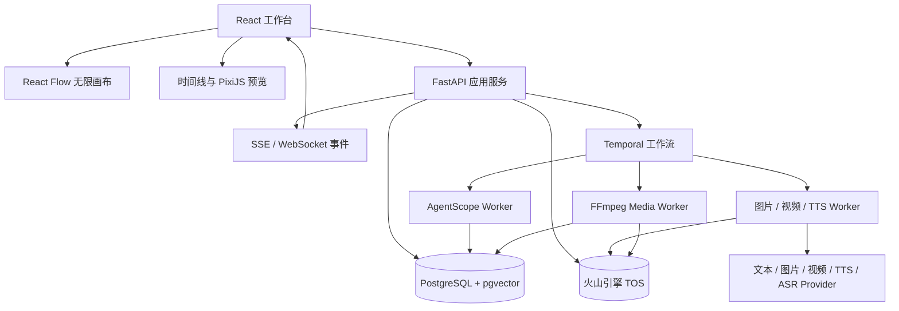
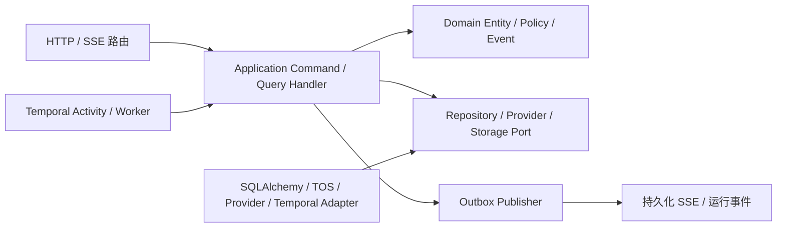

# 视频 Agent 平台技术架构

记录日期：2026-08-17
架构状态：个人本地原型；首版技术选型已确定，近期不进入生产环境。标准启动方式为 Docker Compose，仅支持桌面 Chrome/Edge，不开发手机端。

阶段二架构范围以 [阶段二产品需求](video-agent-phase-two-product-requirements.md) 和 [OpenSpec 规划](../openspec/changes/plan-phase-two-mvp-b/) 为准。本文的 MVP-B 段落是技术背景，不代表相关能力已实现；当前代码和可执行配置优先。

## 产品组成

产品包含两个主要工作区：

1. **无限画布**：使用节点连接小说、剧本、分镜、图片、视频、配音、审查、合成和文件导出步骤。
2. **剪辑工作台**：提供多轨时间线、播放器、字幕、音频、裁剪、拆分、排序、转场和导出。

画布负责定义“做什么”，后端执行系统负责“怎样可靠地完成”，剪辑工作台负责“怎样检查和调整最终成片”。

## 技术选型结论

| 层级 | 选型 | 用途 |
|---|---|---|
| 前端基础 | React 19 + TypeScript + Vite 8 | 重客户端单页应用 |
| 前端路由 | React Router 8 | 项目、画布、剪辑台和设置页面 |
| UI 系统 | shadcn/ui + Radix UI + Tailwind CSS + Lucide React | 源码可控的工作台组件、无障碍交互、主题和图标 |
| 无限画布 | `@xyflow/react` 12（React Flow） | 节点、边、缩放、平移、框选、子流程和视口 |
| 客户端状态 | Zustand 5 | 画布、剪辑器、选择状态和撤销/重做 |
| 服务端状态 | TanStack Query 5 | API 缓存、请求、失效和乐观更新 |
| 数据校验 | Zod 4 | 前端表单、节点配置和 API 边界校验 |
| 剪辑时间线 | 自研领域模型 + 虚拟化轨道 UI | 避免被不成熟的时间线库绑定 |
| 预览渲染 | PixiJS 8 + HTML Media API | 浏览器内画面、文字、图片和视频图层预览 |
| 音频波形 | WaveSurfer.js 7 | 音频波形、选区和播放头同步 |
| 流媒体预览 | HLS.js | 长视频代理文件和自适应预览 |
| 后端 API | FastAPI + Pydantic 2 | 项目、资产、工作流、剪辑、Provider 配置和实时事件 API |
| Agent | AgentScope 2.x | Skill 路由、创作推理、工具权限和 Agent 事件 |
| Skill 路由 | 自建 `SkillRegistry` + `SkillRouter`；可选 `semantic-router` | 首版确定性过滤和关键词/标签排序；候选规模增大后在 Agent Worker 内嵌语义排序，不新增独立服务 |
| 长任务编排 | Temporal | 视频生成、回调、重试、人工审核和断点恢复 |
| 主数据库 | PostgreSQL 18 | 事务数据、JSONB 文档、版本和审计 |
| 向量检索 | pgvector | 小说、素材和项目知识的语义检索，首版按需启用 |
| 缓存与限流 | 首版不依赖 Redis | 单用户本地负载无需额外组件；出现明确性能问题后再加入 |
| 媒体存储 | 火山引擎 TOS + `StoragePort` + 本地临时工作区 | TOS 保存原始素材、代理、缩略图、波形和成片；PostgreSQL 只存对象引用和媒体元数据 |
| 媒体处理 | FFmpeg + ffprobe 独立 Worker | 转码、抽帧、代理、字幕、混音和最终合成 |
| 本地访问 | Docker Compose + `localhost`，可选简单口令 | 个人项目不建设组织、角色、Keycloak 或企业 SSO |
| API 客户端 | OpenAPI 生成 TypeScript 客户端 | 保持 Python API 与前端类型一致 |
| 可观测性 | 结构化日志 + OpenTelemetry（按需） | 先保留本地运行、供应商请求和错误追踪；不搭完整生产监控栈 |

版本号是当前验证基线。正式开发使用锁文件，并按迭代升级，不在代码中依赖 `latest`。

## 为什么选择 Vite 而不是 Next.js

无限画布和剪辑台是重客户端工具，不依赖 SEO。服务端渲染会增加媒体、Canvas、浏览器 API 和状态恢复的复杂度，却不能改善核心工作流。

因此主应用采用 Vite SPA。未来需要官网或公开作品页时，可以单独增加一个 Next.js 展示站点，不让展示需求影响工作台架构。

## 前端 UI 组件体系

首版以 shadcn/ui 作为源码型组件基线，Radix UI 提供 Dialog、Popover、Tooltip、Menu、Tabs 等无障碍交互原语，Tailwind CSS 与 CSS Variables 统一颜色、间距、密度和暗色主题，Lucide React 统一图标。shadcn/ui 的组件源码进入项目仓库，并通过 `shared/ui` 二次封装，业务页面不直接复制多套变体。

| 职责 | 选型 | 使用边界 |
|---|---|---|
| 基础组件 | shadcn/ui + Radix UI | 按钮、菜单、弹窗、浮层、标签页和表单控件 |
| 样式与图标 | Tailwind CSS + CSS Variables + Lucide React | 设计令牌、工作台密度、暗色主题和统一图标 |
| 工作区布局 | react-resizable-panels | 素材库、播放器、属性面板和时间线使用固定区域加可调尺寸 |
| 数据与表单 | TanStack Table + React Hook Form + Zod | 模型管理、任务、资产表格与动态模型参数表单 |
| 拖拽与命令 | dnd-kit + cmdk + Sonner | 素材/轨道排序、命令面板和非阻塞通知；画布拖拽仍交给 React Flow |
| 虚拟化 | TanStack Virtual | 资产列表、运行日志、时间线轨道和可见时间窗 |
| 领域组件 | React Flow + PixiJS + WaveSurfer.js + HLS.js | 无限画布、预览、波形和代理播放，不作为通用 UI 组件 |

首版不同时引入 Ant Design、MUI、Arco Design、Semi Design 或 Mantine，避免主题、弹层、表单与交互规范冲突。剪辑工作台采用固定分区和可调尺寸，不实现 IDE 式任意拖拽停靠；真实使用证明有需要后，再评估 FlexLayout React。

## 总体架构



## 无限画布设计

### 节点类型

- 输入：创意简报、主题、题材、人物设想、小说、剧本、图片、视频、模板、人工文本
- 创作：原创故事/小说生成、改编分析、短剧开发、短剧剧本生成、角色资产、分镜、视觉风格
- 生成：MVP-A 的文本、生图、一个 Agnes image-to-video 模式、媒体检查与导出；Fish Audio TTS、Groq ASR、音乐生成、自动字幕和其余视频模式为 MVP-B 候选
- 控制：条件、并行、合并、重试、人工审核
- 媒体：抽帧、转码、拼接、混音、封面
- 审查：剧本审查、连续性审查、画面审查、合规审查
- 输出：剪辑时间线、MP4、SRT、工程包导出；MVP-A 只交付 `exportProfile=light` manifest/reference-only，portable/完整媒体包属于 MVP-B

### React Flow 的职责边界

以下 React Flow 的保存、编辑和发布能力只属于 MVP-B：

- 节点位置、尺寸、分组和视口；
- 节点配置及输入输出端口；
- 节点之间的数据依赖和控制依赖；
- 用户正在编辑的草稿。

React Flow **不是工作流执行器**。后端负责图校验、版本发布和执行。画布中的运行颜色、进度和错误来自 `node_runs`，不能写回节点定义。

MVP-A 的工作流来源固定为版本化、已发布的 `templateKey=drama-mvp-a-default` WorkflowVersion。后端负责 ensure/bootstrap、binding 和 Run source snapshot；MVP-A 工作台只读显示 source、节点状态和诊断，不提供节点/边编辑、连线、草稿保存或发布 UI。React Flow graph authoring 与发布在 MVP-B 实现。

### 多集短剧领域模型

首版数据模型支持“短剧项目 -> 集 -> 场次 -> 镜头”。`Episode`、`Scene`、`Shot` 是稳定实体；`StorySpec` 属于项目，`ScriptSpec` 属于单集，`ShotSpec` 是版本化事实。候选使用 `generated -> pending_review -> approved|rejected|stale|superseded`，接受后的不可变事实以 current/superseded/archived 引用管理，二者不能混为一个状态机。MVP-A 不创建可编辑 `WorkflowDraft`；其 `scopeType`、`scopeIds`、图编辑与发布仅属于 MVP-B。项目级 `AssetBible` 作为跨集连续性基线，覆盖优先级为项目 -> 集 -> 场次 -> 镜头显式引用；覆盖关系写入 `ShotSpec`、Agent 上下文和运行事件。

故事板与工作流是同一份领域事实的两个投影：MVP-A 工作流只读显示固定 source 的节点依赖、运行状态和诊断，故事板拥有集/场/镜头的受限排序和审核命令，不复制 `ShotSpec`。删除、拆分、合并、跨场移动和通用 Workflow 图编辑属于 MVP-B。每集有一个 current cut；MVP-A 可命名和只读比较不可变 TimelineVersion，但不支持复制 Timeline、通用撤销/重做或恢复旧版本。项目级批量导出必须显式记录 `episode_id` 列表和各自时间线版本，默认分别输出文件。

故事板排序通过带 `revision` 的领域命令保存。MVP-A 不提供跨场移动、批量生成、批量重拍或批量审核；项目级角色、场景或风格变更只生成影响分析和修订任务，不静默改写已确认镜头。

### MVP-B 图模型规则

- 端口必须带类型，例如 `StorySpec -> ShotSpec`，不允许任意连线。
- 使用 React Flow `isValidConnection` 做即时提示，后端再次做权威校验。
- 普通工作流默认为 DAG；循环必须使用受控的 Loop 节点并设置最大次数和成本上限。
- 支持子流程，但子流程发布后按版本引用，不能隐式跟随最新草稿。
- 草稿、已发布版本和运行实例完全分离。

### MVP-B 画布性能

- 使用受控 `nodes` 和 `edges`，节点类型在模块外稳定声明。
- 大画布启用 `onlyRenderVisibleElements`，节点内容分层加载。
- 缩放较小时只显示状态和标题，放大后才显示预览和参数。
- 素材预览使用缩略图和代理文件，绝不在节点内加载原始视频。
- 自动布局使用 ELK.js，手工位置始终优先。

### 素材上下文 Agent 对话

用户选中画布或故事板中的故事、剧本、图片、视频、音频或时间线素材后，右侧属性区可显示相应上下文。会话绑定 `projectId`、`workflowVersionId`、`episodeId`、`sceneId`、`shotId`、`nodeId`、`assetId`、当前 `assetVersionId`、素材类型和显式 refs；MVP-A 不绑定可编辑 `workflowDraftId`。切换集/场/镜头时不得沿用旧素材上下文。

只有图片和视频可以由 AgentScope 输出通过 JSON Schema 校验的 `AssetEditPlan`，其中包含基础版本、修改意图、操作列表、工具策略、预计费用、确认要求和预期输出类型。Agent 不直接写数据库或覆盖文件；故事/剧本修改进入 `TextReview` successor/stale closure，音频和时间线只跳转到其 owner 的 typed command，MVP-A 不定义 `AudioEditPlan` 或 `MixPlan`。

image/video 执行由 `AssetEditWorkflow` 承担，所有结果先登记为候选 `AssetVersion`。服务端先生成 `impactAnalysis` 和 `staleTargets`；用户可以继续追问、接受或拒绝。接受时必须明确替换当前镜头、当前场次、当前集或用户勾选的引用集合，不能使用隐含的“当前节点/全部草稿”范围。已发布工作流、历史运行和工程包保持只读；基础版本变化时返回 `409`，要求刷新或重新生成计划，已在时间线中的旧片段不被静默替换。

## 剪辑工作台设计

### MVP-A 功能范围

- 视频、图片、dialogue、music、ambience、effects 和手工字幕轨道；
- 拖动、裁剪、拆分、删除、排序、播放头、缩放和帧步进；
- 静态音量、mute/solo、线性淡入淡出、cut/crossfade、静态位置/缩放/透明度；
- 字幕文本和时间编辑、dialogue ducking、代理预览和后台导出；
- 从已审核、派生文件 ready 的镜头装入当前集时间线。
- 每集独立时间线；每集只有一个 current cut，用户可命名并只读比较不可变版本。项目可显式选择一个或多个集和各自 TimelineVersion 导出，默认分别生成按集号命名的 MP4。

MVP-B 再考虑复制/吸附、独立自动保存、Undo/Redo、版本恢复、字幕样式、Narration/TTS、loop、speed、track lock、多机位、专业调色、蒙版跟踪、复杂关键帧曲线、插件市场和浏览器内 4K 实时合成。

### 时间模型

所有剪辑时间以整数帧保存，避免浮点秒数产生漂移：

```text
TimelineDocument
  fps
  width / height
  tracks[]
  clips[]
    assetVersionId
    trackId
    timelineStartFrame
    sourceInFrame
    durationFrames
    transform
    volume
    transition
  captions[]
  revision
```

音频处理层可以保存采样位置，但 UI 和视频合成契约统一使用帧。时间线文档使用 JSONB 版本快照，运行中的导出永远引用不可变版本。MVP-A 只支持导入 dialogue、music、ambience、effects 音频资产，不接入 TTS、ASR、音乐生成或自动字幕对齐。MVP-A ducking 以 `enabled`、合并后的 30fps 整数 dialogue 区间、`attenuationDb`、`attackFrames`、`releaseFrames` 和 `targetTracks=music|ambience|effects` 保存；canonical RenderPlan 将其映射到 FFmpeg filter graph，dialogue 不被压低，proxy 与最终渲染共享同一参数。

### 预览和最终渲染

- 浏览器使用 PixiJS 合成代理视频、图片和文字，追求交互速度。
- 后端 FFmpeg Worker 使用同一份时间线文档生成最终成片。
- 每个素材入库后生成标准代理、缩略图、关键帧索引、波形和媒体信息。
- 导出前运行一次服务端预检，拒绝缺失素材、越界裁剪和不支持的编码参数。
- 浏览器预览与 FFmpeg 输出必须建立固定样例做像素、时长和音频同步回归测试。

当前不把 Remotion 作为基础依赖。它适合模板化 React 视频，但其自定义许可证需要单独评估，而且容易形成第二套渲染语义。后续若大量使用模板视频，可以把 Remotion 作为独立渲染节点，而不是剪辑台核心。

## 后端工程架构

### 当前实现与目标形态

阶段 0 的 `services/api/src/video_agent_api/` 目前以 `app.py`、`db.py`、`domain/`、`ports/` 和 `skills/` 提供最小可运行基础，已经验证共享 Schema、稳定 ID、版本、Mock Provider、LocalWorkspaceAdapter 和确定性 Skill 路由。它**不是**下列目标分层的完成状态。

后续以“模块化单体 + Ports/Adapters + 领域分层”演进：FastAPI、PostgreSQL 与业务代码仍在一个 API 服务中部署，资源和副作用差异明显的 Agent、生成、媒体任务继续由独立 Worker 承担。这样保留个人项目的低运维成本，同时把未来拆分服务所需的边界固定下来。

### 目标目录

```text
services/api/src/video_agent_api/
  bootstrap/
    settings.py              # 环境、Docker Secret、容器装配
    container.py             # DI / composition root
    lifespan.py               # FastAPI 生命周期
  shared/
    domain/                  # EntityId、DomainError、DomainEvent 等稳定原语
    application/             # UnitOfWork、Result、分页和通用 Port
    infrastructure/          # 共享 SQLAlchemy、Outbox、日志实现
  modules/
    projects/ episodes/ assets/ audio/ asset_edits/
    workflows/ runs/ timelines/ reviews/
    providers/ skills/ usage/ exports/
  interfaces/
    http/                    # 路由聚合、依赖、错误映射、SSE
    events/                  # Outbox publisher、事件序列化
  infrastructure/
    persistence/             # SQLAlchemy engine、Session、Alembic 接入
    temporal/                # client、starter、Activity 装配
    providers/ storage/ security/ observability/
  app.py                     # 只创建 application，不放业务规则

workers/
  agent/ generation/ media/  # 各自入口、task queue 与资源/凭据边界
```

每个复杂模块使用同一内部模板；简单模块可以省略空目录，但不能越过分层边界：

```text
<module>/
  domain/{entities,value_objects,events,policies}.py
  application/{commands,queries,handlers,dto,ports}.py
  infrastructure/{orm,repositories}.py
  interfaces/http.py
```

`bootstrap` 是唯一的 composition root：读取环境变量和 Docker Secret，创建 Session/UoW、Repository、Provider/Storage Adapter、Temporal Client、Handler 和 Router。业务模块不得自行读取环境变量、创建 SDK Client 或实例化其他模块的基础设施实现。

### 模块所有权

| 模块 | 拥有的业务事实 | 对外应用能力 |
|---|---|---|
| `projects` | 项目、CreativeBrief、项目级设置和预算阈值 | 创建/查询项目，更新创作约束和项目设置 |
| `episodes` | Episode、Scene、Shot、排序、连续性覆盖和 AssetBible 引用 | 维护多集/多场/多镜头结构，执行受 revision 保护的故事板命令 |
| `assets` | Asset、AssetVersion、对象引用、lineage、上传会话 | 登记不可覆盖版本，创建上传/下载与媒体入库任务 |
| `audio` | AudioAsset、SoundCue、授权、混音相关引用 | 管理配乐、环境音、音效、对白和其时间线引用 |
| `asset_edits` | 对话会话、EditPlan、候选版本、影响分析和接受决定 | 将素材对话转换为受控候选和显式引用替换命令 |
| `workflows` | WorkflowDraft、WorkflowVersion、图校验和发布 | 保存/发布后端不可变执行图与默认 Workflow bootstrap；graph editor UI MVP-B |
| `runs` | WorkflowRun、NodeRun、持久化运行事件和取消/Signal 记录 | 启动、查询、取消和补发运行状态 |
| `timelines` | TimelineDraft、TimelineCut、TimelineVersion、Clip 和混音预检 | 保存版本化剪辑，创建预览和渲染命令 |
| `reviews` | 审核任务、评论、通过/驳回/重拍决定 | 提交人工审核决策并唤醒等待流程 |
| `providers` | Provider、Credential、Model、能力快照和项目绑定 | 管理数据驱动的模型与存储配置、连通性和同步 |
| `skills` | SkillRevision、许可、启用状态和路由审计 | 解析、筛选、路由和审计已安装 Skill |
| `usage` | 预算预留、成本估算、用量账本和结算状态 | 在付费任务前保留额度并汇总实际/未知成本 |
| `exports` | ExportJob、ExportManifest 和工程包引用 | 固定版本，创建 MP4、SRT 与工程包导出任务 |

模块之间不导入对方的 ORM、Repository 实现或私有实体。跨模块协作优先使用 application facade、稳定 ID、版本化共享 Schema 或领域事件；`shared` 只容纳至少被两个模块稳定复用的通用原语，不能成为无归属的业务目录。

### 分层依赖与调用规则



- **Domain**：实体、值对象、领域策略和领域事件；不依赖 FastAPI、Pydantic HTTP DTO、SQLAlchemy、Temporal、AgentScope、FFmpeg 或 Provider SDK。
- **Application**：Command/Query、Handler、DTO、Port 和用例编排；写入必须从 Command Handler 进入，读取可使用只读 DTO 投影，但不得藏写入副作用。
- **Infrastructure**：SQLAlchemy Repository、TOS、Provider、加密、Temporal 和可观测性 Adapter；只实现内层定义的 Port，不决定业务流程。
- **Interfaces**：FastAPI Router、Pydantic 请求/响应、SSE、Outbox 事件外发；只做传输适配、鉴权、边界校验、调用 Handler 和结果映射。

禁止 `domain -> infrastructure/interfaces`、`application -> FastAPI/SDK/ORM` 和模块间的基础设施反向依赖。需要引入共享行为时先判断是否属于单一模块；不能以“方便导入”为由放入 `shared`。

### 事务、Repository、Outbox 与并发

一个 application Command Handler 对应一个 `UnitOfWork`（Unit of Work）事务：加载聚合、执行领域行为、持久化聚合，并在同一 PostgreSQL 事务写入领域事件对应的 Outbox 记录。Repository 接口定义在 application/domain 边界，实现留在 infrastructure，接口围绕聚合与用例定义，禁止演变为泄漏 SQLAlchemy Query 的通用 CRUD 包装。

外部网络、对象存储、AgentScope、Provider、FFmpeg 和 Temporal 启动不得发生在数据库事务中。提交后由 Outbox Publisher 可靠驱动 SSE/运行事件、Temporal 启动命令或其他后续操作；稳定业务 Workflow ID 与幂等 starter 处理 `AlreadyStarted`，避免数据库提交与启动之间的短暂失败造成重复任务。

草稿与排序命令带 `revision`。更新语句必须以当前 revision 为条件并原子递增；冲突返回最新允许公开的摘要，不采用最后写入者覆盖。发布、导出和生成只引用不可变版本，绝不在历史运行中读取“当前草稿”。

### API、错误与实时事件

FastAPI 路由负责鉴权、HTTP/Pydantic 边界校验、调用 command/query handler、序列化和异常映射。它不直接访问 `Session`、Provider/Storage SDK 或 FFmpeg，也不等待视频生成完成。

| 情形 | HTTP | 稳定错误语义 |
|---|---:|---|
| 对象不存在 | `404` | `not_found` |
| 过期 revision、幂等冲突或基础版本变化 | `409` | `revision_conflict` / `operation_conflict` |
| 领域规则、Schema 或可恢复输入错误 | `422` | `validation_failed` / 领域专属代码 |
| 未认证或无权操作 | `401` / `403` | `unauthorized` / `forbidden` |
| Provider 协议或上游拒绝 | `502` | `provider_rejected` / `provider_protocol_error` |
| Provider、TOS、Temporal 等暂不可用 | `503` | `dependency_unavailable` |

错误响应统一包含 `error_code`、用户可读 `message`、`trace_id` 和经过脱敏的 `details`。运行和素材编辑事件先持久化并拥有单调序号；SSE 使用 `Last-Event-ID` 从持久化事件流补发。进程内队列只能帮助唤醒连接，不能成为事件事实源。

### Temporal 与 Worker 工程边界

每次画布运行、素材编辑、媒体入库、音频混音和导出均可对应可恢复的 Temporal Workflow。Workflow 只执行确定性分支、等待、重试、Child Workflow 和 Activity 调度，禁止直接访问网络、数据库、当前时间、随机数、本地文件或 SDK。Activity 执行所有副作用，并携带 `run_id + logical_operation` 等业务幂等键。

- **Agent Worker**：装配 AgentScope、SkillRegistry/Router、文本创作和 EditPlan Activity；只通过 application service 和已授权 Tool/Port 访问业务能力。
- **Generation Worker**：MVP-A 装配 Text/Image/Video Adapter，提交、轮询和候选资产登记；TTS/ASR、callback/webhook 与其他视频模式为 MVP-B 目标扩展，不在 Worker 内复制素材、预算或版本规则。
- **Media Worker**：装配受控 FFmpeg/ffprobe、StoragePort 和媒体 application service，生成代理、缩略图、波形、字幕、混音和最终输出；不能执行模型产生的 shell 或滤镜字符串。

不同 Worker 采用独立 task queue、资源限制和凭据访问边界。个人版可同机运行，但媒体任务不能与 API 共用执行线程池；Temporal database 与业务 PostgreSQL 使用独立数据库/用户，业务代码不查询 Temporal 内表。

### 配置、依赖注入与测试结构

运行设置只由 `bootstrap/settings` 读取，Docker Secret 仅在调用 Adapter 时解密使用。Provider、Model、Storage 与项目绑定继续从 PostgreSQL 数据配置加载，业务代码不得写死模型、`base_url`、bucket 或 region。测试通过 composition root 注入 fake/in-memory Repository、UoW 和 Port，不需要启动 FastAPI、真实 Provider 或真实 TOS。

```text
services/api/tests/
  unit/<module>/domain/          # 实体、值对象、策略、领域事件
  unit/<module>/application/     # handler、Port fake、事务和错误分支
  adapters/                      # SQLAlchemy、TOS、Provider、加密、FFmpeg adapter
  integration/                   # PostgreSQL、Alembic、Outbox、Temporal、HTTP 组合
  architecture/                  # 依赖方向、模块私有边界、固定配置扫描
  contract/                      # OpenAPI、JSON Schema、事件 payload
  bdd/                           # 用户可观察的端到端业务场景
```

按 TDD 先写失败的 domain/application/contract 或 BDD 测试，再做最小实现。真实 Provider 仅在显式启用的沙箱或手工 capability 验证中调用，默认 CI 和本地测试不得产生付费请求。架构测试必须能拒绝领域层导入 FastAPI/SQLAlchemy/Temporal/SDK，以及新增代码依赖已弃用平铺入口。

### 从阶段 0 的迁移规则

1. 不把当前阶段 0 平铺代码误写为已完成目标架构；现有 API 行为、迁移和共享 JSON Schema 仍是权威事实。
2. 每个后续 OpenSpec change 选择一个垂直功能切片，先建立目标模块、失败测试和应用入口，再迁移路由、领域行为、Repository 与 Adapter。
3. 旧入口在过渡期只做兼容委派；同一业务规则不得在旧服务和新模块维护两份。无调用后再删除旧实现。
4. 目录移动不改变表名、稳定 ID、JSON Schema 或 API 契约；需要变更任何对外契约或数据迁移时，必须在该 change 中单独说明兼容策略和验证。
5. 首批迁移顺序为 `projects/episodes`、`assets/audio`、`workflows/runs/timelines`、`providers/skills/usage`、`exports/asset_edits/reviews`，随后才接入真实 Provider 和媒体执行链路。

## 模型与供应商适配层

业务层只依赖六个 Port：

- `TextModelPort`：Codex 中转站（推荐默认 live Profile）、DeepSeek；首次运行、CI 和默认本地测试仍为 Mock/Local；
- `ImageGenerationPort`：GPT Image 2 中转站，首版模型标识为 `gpt-image-2`；
- `VideoGenerationPort`：Agnes AI（首接）、MiniMax H3、Seedance 2.5；
- `TtsPort`：Fish Audio（MVP-B）；
- `AsrPort`：Groq（MVP-B）；
- `StoragePort`：火山引擎 TOS 为主存储，LocalWorkspaceAdapter 负责临时工作区和缓存。

Agnes AI 是首个视频 Provider。使用 `https://apihub.agnes-ai.com/v1`，通过 `POST /v1/videos` 创建异步任务，通过 `GET /v1/videos/{video_id}` 查询。MVP-A 仅冻结账号 probe 通过的一个稳定 image-to-video mode、当前 storyboard AssetVersion、ShotSpec、显式时长和画幅，并只实现 submit/poll/cancel/result；预览、`agnes-video-2.5`、text-to-video、关键帧、多模态参考与 callback/webhook 均不在阶段一验收。

GPT Image 2 中转站是首个图片 Provider，首版模型标识为 `gpt-image-2`。`base_url`、模型标识和默认参数从数据库读取，不写死在业务代码中。`ImageGenerationPort` 统一文生图和编辑调用；参考图、多图输入、局部/遮罩编辑、透明背景、尺寸、质量、批量数量和输出格式按 capability probe 与参数 Schema 开放。返回的 URL 或 base64 内容先进入隔离临时目录，完成 MIME、尺寸、checksum 和安全校验后上传到 TOS，再登记为不可覆盖的 `AssetVersion`，并记录提示词版本、输入图片版本、模型、参数和 request ID。

文本生成同样是首版主链路，而不是外部前置工作。用户可只提交 `CreativeBrief`，或以 `creationMode=adaptation` 提交 novel/synopsis/existing_script 的 inline_text/uploaded_file SourceMaterial；Run 冻结 source revision/contentHash。默认 Workflow 的文本角色只允许 `novel-writing` 与 `drama-skills`，再通过 `TextModelPort` 调用显式启用的 Codex live Profile 或 DeepSeek；默认测试始终使用 Mock/Local。Skill 负责流程、上下文、Schema 与检查规则，文本模型负责实际生成。经一次 TextReviewBatch 确认的项目级 `StorySpec`、每集 `ScriptSpec` 才能进入资产、分镜与视频生成。

MiniMax H3 与 Seedance 2.5 作为后续视频 Provider，通过同一 `VideoGenerationPort`、能力声明和参数 Schema 接入。所有 Provider、模型、能力与参数均可作为 catalog candidate 从数据库读取；只有 installed adapter、approved capability snapshot、`runnable=true` 且 `featureGate=MVP-A` 的 operation 能连接测试、启用或作为默认，业务代码不写死模型名。

Provider 管理保存 `provider`、`base_url`、协议/adapterKey、认证方式、超时、轮询/回调模式、限流并发、价格单位、默认参数和密钥状态；模型管理保存模型标识、能力声明、能力快照和参数 Schema。已有 Adapter 内新增模型可手工或 `/v1/models` 同步，新增协议/认证/回调语义必须新增 Adapter。每次调用记录 request ID、输入输出资产、参数摘要、状态、错误码、耗时、重试、能力快照及可获得的费用或估算；unknown cost 必须保留未知状态。供应商原始响应必须转换成统一结果，不能把 SDK 对象写进业务表或工作流历史。

API 密钥使用 AES-256-GCM 加密后写入 PostgreSQL，主加密密钥通过 Docker Secret 挂载，绝不写入数据库。API 和日志只返回类似 `sk********jjjj` 的掩码；不提供完整密钥回显，只允许替换或轮换。密钥、完整认证头和私密响应不得进入提示词、Skill 文本、SSE 事件或普通日志。

## 数据库设计

PostgreSQL 是唯一业务事实源。建议的核心表：

- `app_settings`、`providers`、`provider_credentials`
- `projects`
- `episodes`、`scenes`、`shots`、`episode_scenes`、`scene_shots`、`episode_continuity_overrides`
- `workflow_drafts`、`workflow_versions`
- `workflow_runs`、`node_runs`
- `assets`、`asset_versions`、`asset_relations`
- `storage_providers`、`storage_buckets`、`stored_objects`、`upload_sessions`
- `asset_edit_sessions`、`asset_edit_messages`、`asset_edit_plans`、`asset_edit_candidates`（MVP-A 仅 image/video）
- `creative_briefs`、`story_spec_versions`、`script_spec_versions`、`episode_spec_versions`、`scene_spec_versions`、`shot_spec_versions`、`asset_bibles`
- `timeline_drafts`、`timeline_cuts`、`timeline_versions`、`timeline_clips`（MVP-A 不含复制、Undo/Redo 或 restore）
- `generation_jobs`、`render_jobs`
- `approvals`（评论/时间码属于 MVP-B）
- `skill_revisions`、`models`、`model_capabilities`、`model_parameter_schemas`、`project_model_bindings`
- `export_jobs`、`export_manifests`
- `provider_calls`、`audit_logs`、`usage_reservations`、`usage_ledger`

关键原则：

- 工作流和时间线均采用不可变版本；运行只引用具体版本。
- 短剧项目、集、场次和镜头使用稳定 ID；故事板排序通过 revision 乐观锁保存，显示编号变化不破坏引用。
- 故事板与工作流共享 Episode/Scene/ShotSpec，不允许为两个视图复制一份镜头事实。
- 每集时间线独立版本化；项目级批量导出必须显式记录 episode_id 列表和各自 TimelineVersion。
- 项目级连续性资产可跨集引用，集/场覆盖必须可追溯且不能静默改变已确认镜头。
- 大型 JSON 输出保存在对象存储，数据库保存索引、摘要和引用。
- 视频、图片和音频二进制文件不得写入 PostgreSQL。
- `asset_versions.storage_object_id`、`render_jobs.output_object_id` 和 `export_manifests.object_refs` 指向 `stored_objects`；对象记录保存 provider、bucket、region、object key、ETag/checksum、MIME、大小、媒体信息和 storage class。
- `asset_versions` 不覆盖原文件；重新生成、转码和人工替换都产生新版本。
- 素材编辑会话绑定基础资产版本；MVP-A 的 AssetEditPlan 和候选结果仅针对 image/video 且不可变，只有用户接受后才能更新明确的镜头/场/集引用。故事/剧本通过 TextReview，音频/Timeline 通过 typed command；MVP-A 不更新 WorkflowDraft 引用。
- JSONB 用于节点配置和版本文档，供应商调用、成本估算和运行状态仍使用关系字段。
- pgvector 只保存检索向量和引用，不取代项目状态或完整文本。
- 已被历史运行引用的 Provider 或模型不能物理删除，只能停用，以保证导出 manifest 可追溯和运行复现。

## 文件导出与工程包

- MP4 导出引用不可变时间线版本，由 FFmpeg Worker 后台渲染。
- SRT 可独立导出，并与时间线字幕版本和成片帧率绑定。
- MVP-A 轻量工程包包含项目设置、固定 WorkflowVersion source、StorySpec、AssetBible、ShotSpec、时间线、模型/Skill 版本、参数、字幕和资产 manifest，不复制大型媒体。
- MVP-B portable/完整工程包才在同一公共 manifest 上包含全部源素材、代理、生成结果、音频和 checksum，可迁移并重新导入；不得改变 MVP-A 的引用与审计字段。
- 首版不包含发布平台、账号授权或渠道上传入口。

不选 MongoDB 作为主库，因为项目、版本、运行、资产和供应商调用之间存在强关系，并且需要可靠事务。PostgreSQL 的关系模型加 JSONB 已覆盖当前需求。

## 对象存储、本地工作区与上传

- 首版使用[火山引擎对象存储 TOS](https://docs.volcengine.com/docs/6349/?lang=zh)作为媒体主存储。Bucket、Region、Endpoint、认证方式和访问域名由配置管理，不写死在业务代码中。
- TOS Bucket 默认私有；浏览器通过短期 presigned URL 或 API 代理的 multipart 会话上传，不接触永久 AK/SK，也不使用永久公开媒体 URL。
- 浏览器保存 part number、ETag 和断点状态；完成上传后，服务端调用 complete/stat，并校验 checksum、真实 MIME、大小和项目归属。
- 每个对象使用不可变 key，例如 `projects/{project_id}/assets/{asset_id}/{version_id}/original.ext`。重新上传、转码、重生成和人工替换都产生新对象与新 `AssetVersion`。
- Media Worker 只把当前任务需要的源文件下载到隔离工作目录，使用 FFmpeg/ffprobe 处理后把代理、缩略图、波形、关键帧索引和成片上传回 TOS。
- 本地磁盘只保存上传分片、FFmpeg 工作文件、代理缓存和失败临时文件；按 TTL 和磁盘软/硬阈值清理，不作为项目事实或长期备份。
- 所有读写经 `StoragePort`。实现 `TOSAdapter` 与 `LocalWorkspaceAdapter`；Local Adapter 只用于开发、缓存和离线测试，业务契约不得保存本地绝对路径。
- `StoragePort` 至少提供创建/恢复/完成分片会话、`presignRead`、`presignWrite`、`stat`、下载到工作区、从工作区上传和删除对象的能力。
- TOS 暂时不可用时任务进入 retryable 状态并保留幂等键；对象删除失败时不能先删数据库引用。媒体 GC 只能回收没有 AssetVersion、运行、时间线或工程包引用的对象。
- PostgreSQL、TOS 对象 manifest/版本信息、Compose 配置、Docker Secret 主密钥和对象存储凭据分别备份；恢复后按 manifest 校验 checksum/ETag，并完成手工恢复 runbook 演练，不使用工程包回导。
- MVP-A 轻量工程包保存 object refs、版本、checksum 和 storage metadata，但仅作为导出 artifact；portable/完整工程包固定对象版本、下载实际媒体并支持回导，均属于 MVP-B。没有 TOS 凭据时，MVP-A 返回明确的恢复诊断而不导入 light 包。

## 实时状态与协作

首版：

- 使用 SSE 推送 Agent 文本、素材修改计划、候选生成进度、节点进度、工具调用、生成状态和渲染日志。
- 使用数据库 revision 做乐观锁，避免同一用户的两个窗口静默覆盖画布或时间线。
- MVP-A 不提供本地撤销/重做；客户端只在 409 时回滚并重新读取 owner state。命令历史属于 MVP-B。

未来确有多人实时协作需求时，再引入 Yjs + Hocuspocus：

- React Flow 节点位置和编辑状态进入 Yjs 文档；
- 时间线操作使用领域命令同步，而不是直接同步整个 JSON；
- 在线光标、选择和临时播放状态不写数据库；
- 发布版本仍由后端事务创建。

## Agent 与 Skill 接入

- 顶层 Agent 根据项目类型和阶段路由 Skill，不把全部 Skill 拼进系统提示词。
- 阶段一登记八项 registry candidate：`drama-skills`、`novel-writing`、`zy-cinematic-realism`、`seedance-2.0`、`storyboard-tiktok-video-skill`，以及 Hell Grind 的 `hell-grind/cinedance-higgsfield`、`hell-grind/acting`、`hell-grind/lira`。Worker 启动只读取 Registry 索引和 approved metadata，不把候选集合当作启动 lock。默认 Workflow 只绑定 approved 的 `novel-writing` 与 `drama-skills`；其他六项可保持 `pending_provenance` 或 `disabled`，只有节点 `allowedSkills` 允许、显式启用且路由条件满足时才影响新运行。
- `SkillRegistry` 只读取固定本地快照、`SKILL.md` 和必要 references，不跟随远端 `main`、不自动更新、不执行第三方脚本；PostgreSQL 保存 immutable `SkillRevision`、来源状态、准入结果和路由审计。Git 来源记录 commit/digest；公开网页 Markdown 记录 archive URL、获取时间、digest 与 license status。未完成审计的 candidate 不可路由，失败只阻断请求该 revision 的节点。
- `SkillRouter` 是通用路由边界，不写死某两个 Skill：先按项目类型、阶段、目标模型、能力、许可证、启用状态、节点 `allowedSkills` 和输入/输出 Schema 做确定性过滤，再用关键词/标签排序；候选规模增大后，可选用 [`semantic-router`](https://github.com/aurelio-labs/semantic-router) 对候选做语义排序。语义库不可用时自动回退，不阻断工作流。新增 Skill 注册后默认不改变阶段一流程，只有被显式启用且满足路由条件时才进入新运行候选。
- `semantic-router` 仅负责语义路由评分，不负责 Skill 安装、版本管理、许可证、MCP 工具或审计；首版不单独部署服务，也不把向量模型作为启动前置条件。
- `WorkflowVersion` 固定拓扑、operation、`allowedSkills` 和 requiredCapabilities；每个选择显式声明 `selectionMode=fixed|inherit`。默认模板的文本角色限制为 `novel-writing`/`drama-skills`，Provider/Profile/Model 通常使用 `inherit`，按 `workflow node > project default > enabled system default` 解析。若存在多个同分候选必须人工选择；选定的 `SkillRevision`、模型、参数和 capability snapshot 写入 `WorkflowRun`/`NodeRun`，历史运行只读，刷新、重试和 Worker 重启不得重新路由或加载漂移版本。
- 加载采用渐进方式：先读取摘要和 manifest，路由确认后才读取 `SKILL.md` 与必要 references；Skill 只能提供流程、上下文、Schema 和检查规则，不能直接访问 Provider、数据库、文件系统、网络、子进程或密钥，所有副作用必须通过受控 Tool/Port。
- Agent 输入和输出都转换成 `CreativeBrief`、`StorySpec`、`ScriptSpec`、`ShotSpec`、`GenerationSpec` 等结构化对象。
- 每个 Agent 节点保存 Skill source identity（Git commit/digest 或公开 Markdown archive URL/获取时间/digest/license status）、模型、参数、输入资产版本和输出版本。
- Skill 只产生建议或规格；上传、生成、文件写入和导出必须通过受控 Tool。
- AgentScope 的事件流转换成统一 `node_run_event` 后通过 SSE 发给画布。
- 人工修改后的剧本、分镜或时间线成为新的事实版本，后续 Agent 不得恢复旧结果。

详细 Skill 方案见 [视频 Agent 候选能力与集成记录](video-agent-integration-notes.md)。

## 安全要求

- API 默认只监听 `127.0.0.1`；局域网访问必须显式开启并增加简单认证或受控反向代理。
- MVP-A 的 SourceMaterial 只接受 inline text 或 uploaded file；GPT Image 不接受用户提供的任意远程 URL。任何未来 URL 导入、或 Provider 返回的 URL，均需 HTTPS allowlist、禁止重定向与内网地址，并执行 SSRF、大小和超时限制。
- 上传文件验证真实类型，并对公开协作场景增加恶意文件扫描。
- FFmpeg 接口只接受结构化参数，不接受模型生成的任意命令字符串。
- Agent 和第三方 Skill 在隔离 Workspace 中运行。
- 付费生成、批量生成、覆盖和删除操作需要预算预检与二次确认。
- MVP-A Agnes 不接入 callback/webhook；后续 Provider callback 必须验证签名并以幂等方式处理。
- Provider 密钥加密写入 PostgreSQL，主密钥由 Docker Secret 挂载；解密仅发生在对应 Worker 的调用边界。
- TOS 使用私有 Bucket 和最小权限凭据；签名 URL 短期有效并校验对象所属项目。AK/SK、签名 URL、完整认证头不得进入 Agent 上下文、Skill、SSE 或普通日志。
- 所有资产来源、生成模型、Skill 版本、关键操作和导出记录进入本地运行日志。

## 工程与部署

建议单仓库结构：

```text
apps/
  web/                 React 工作台
services/
  api/                 FastAPI 应用服务
workers/
  agent/               AgentScope Worker
  generation/          生成供应商 Worker
  media/               FFmpeg Worker
packages/
  contracts/           JSON Schema 与生成类型
  ui/                  共享 UI 组件
infra/
  compose/             Docker Compose 单机环境
data/workspaces/       上传分片、FFmpeg 工作目录和可清理缓存（gitignore）
```

- 前端使用 pnpm 和锁文件。
- Python 使用 uv、Python 3.12 和锁文件。
- 数据迁移使用 Alembic。
- 开发和运行均以 Docker Compose 为标准入口，包含 Web、API、PostgreSQL、Temporal、Agent Worker、Generation Worker 与 Media Worker，并挂载临时工作区、加密主密钥 Secret 和对象存储凭据 Secret；TOS 是外部托管服务，不作为本地容器启动。
- Redis 仍是未来可选项；不部署 MinIO 作为 TOS 的重复主存储。
- 当前不建设 Staging、Production 或 Kubernetes；出现跨设备或多人需求后再补认证、远程 Worker、访问加速和容器平台。
- CI 包含前端类型检查、Vitest、Playwright、pytest、迁移检查和密钥扫描。

## 明确不采用的方案

- 不使用 React Flow 直接执行任务。
- 不让 AgentScope 代替持久化工作流引擎。
- 不使用 Celery 作为需要人工暂停和长时间回调的核心编排器。
- 不把 n8n 作为产品内部的权威运行时；它可以用于外围运营集成。
- 不把视频二进制写入 PostgreSQL。
- 不直接在浏览器处理最终高码率渲染。
- 不在首版引入 MongoDB、独立向量数据库或 Elasticsearch。
- 不在首版开发实时多人协作和完整专业剪辑功能。

## 第一阶段交付顺序

1. 定义工作流、节点端口、资产、镜头和时间线 JSON Schema。
2. 建立 React 工作台壳层和设计系统。
3. MVP-A 只完成固定 published WorkflowVersion 的只读 source/run 投影和素材 Agent 面板；React Flow 画布、节点库、连线校验、草稿保存和版本发布 UI 延后到 MVP-B。
4. 完成 FastAPI、PostgreSQL、TOS 分片/断点上传、短期签名读取、本地工作区和 Provider Profile。
5. 在显式 opt-in 的 Codex live Profile 上完成模型 candidate diff 与文本 probe，默认测试保持 Mock/Local；接入 GPT Image 2 中转站，跑通角色/场景/分镜图生成与参考图编辑；实现 image/video AssetEditWorkflow、AssetEditPlan、impactAnalysis、候选版本和按镜头/场次/集/勾选引用替换；再使用 Temporal 跑通 Agnes 一个探测通过的稳定 image-to-video 模式和一个人工审核节点。
6. 完成 MVP-A 剪辑台：每集 current cut、代理预览、video/dialogue/music/ambience/effects/字幕轨、裁剪、拆分、删除、排序、静态 transform、dialogue ducking 和立即持久化 command，背景音乐先使用导入资产。
7. 完成 FFmpeg 1080p 导出，并校验预览与成片的一致性；多集默认分别输出文件。
8. 接入短剧、审查 Skills；MVP-B 再接入 Fish Audio、Groq ASR、Agnes 其余已验证能力、Seedance 和更广的视频编辑能力。
9. MVP-A 加入 MP4、SRT、light manifest/reference-only 导出、用量预占/结算、关键操作记录、本地工作区配额和运行诊断；MVP-B 再加入 portable/完整工程包媒体载荷与回导。

第一阶段验收目标是一条可恢复、可人工修改、可导出的视频链路，而不是一次性堆齐所有节点和剪辑功能。
